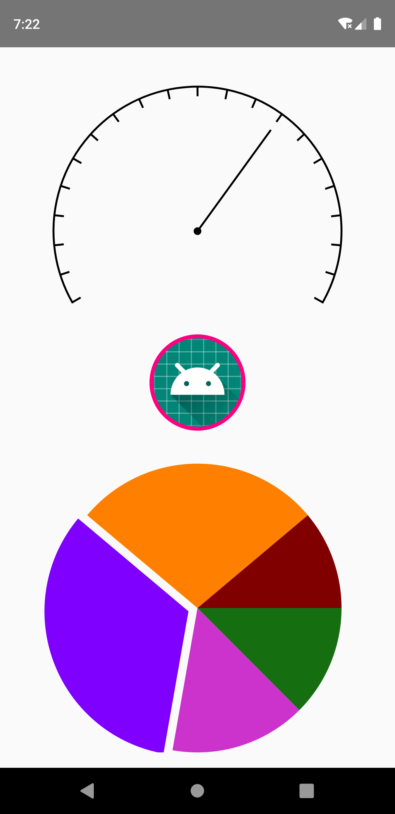
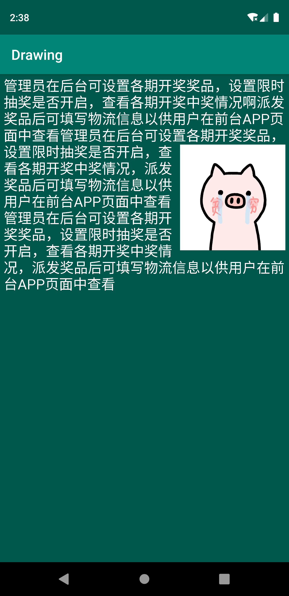
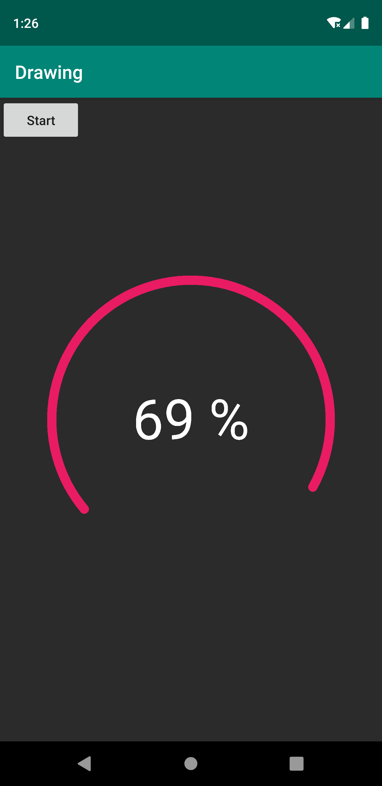
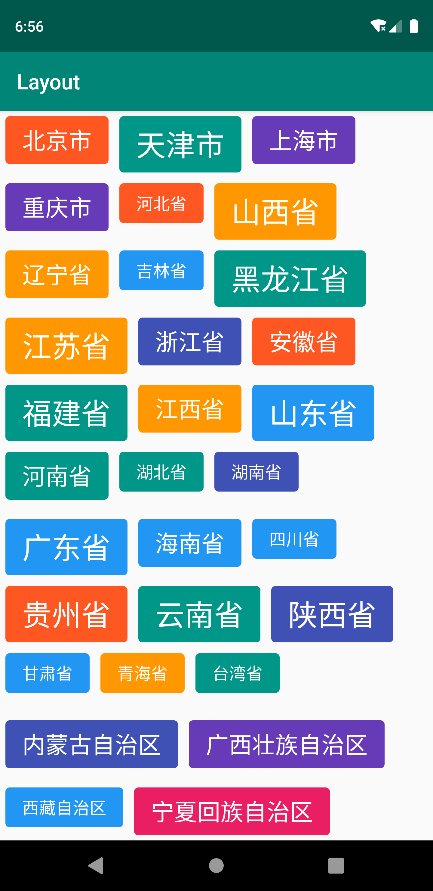

# HencoderPlus 课程笔记

#### 01-HTTP 的概念、原理、工作机制、数据格式和 REST-讲义
- [讲义](./note/01-HTTP工作原理.pdf "HTTP原理") 
- [笔记](./note/01-HTTP工作原理.md "HTTP原理")

#### 02-编码加密和登录授权
- [讲义](./note/02-编码加密和登录授权.pdf "编码加密和登录授权") 
- [笔记](./note/02-编码加密和登录授权.md "编码加密和登录授权")

#### 03-登录和第三方授权
- [讲义](./note/03-登录和第三方授权.pdf "登录和第三方授权") 
- [笔记](./note/03-登录和第三方授权.md "登录和第三方授权")

#### 04-TCPIP和HTTPS
- [讲义](./note/04-TCPIP和HTTPS.pdf "TCPIP和HTTPS") 
- [笔记](./note/04-TCPIP和HTTPS.md "TCPIP和HTTPS")

#### 20-Android拖拽和嵌套滑动处理
- [讲义](./note/20-拖拽和嵌套滑动.pdf "拖拽和滑动嵌套") 
- [笔记](./note/20-拖拽和嵌套滑动.md "拖拽和滑动嵌套") 

#### 21-Android多线程的使用以及线程同步的处理
- [讲义](./note/21-多线程和线程同步.pdf "多线程和线程同步") 
- [笔记](./note/21-多线程和线程同步.md "多线程和线程同步") 

#### 22-线程间通信和Android多线程
- [讲义](./note/22-线程间通信和Android多线程.pdf "线程间通信和Android多线程") 
- [笔记](./note/22-线程间通信和Android多线程 "线程间通信和Android多线程") 

- 自定义View测量

- 图文混排，多行文字测量

- 自定义属性动画ObjectAnimator

- 自定义View颜色和位置渐变

- 翻页效果

- MaterialEditText效果

- 自定义布局，手写TagLayout

- 双向滑动缩放的ImageView

- 多点触控

- MotionLayout动画

