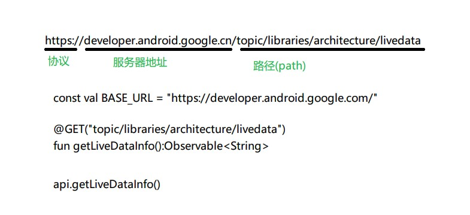
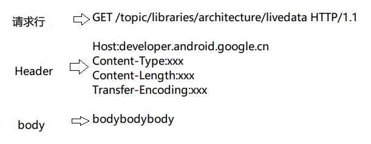
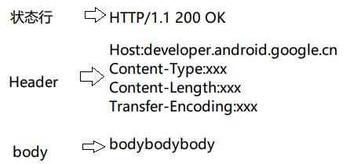
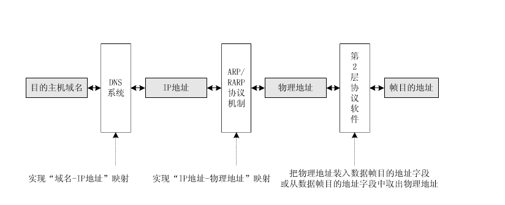

###  HTTP的定义
> 一种网络传输协议，位于 TCP / IP 协议族的最顶层——应⽤层

### HTTP
>Hypertext Transfer **[Protocol](https://techterms.com/definition/protocol "A protocol is a standard set of rules that allow electronic devices to communicate with each other. These rules include what type of data may be transmitted, what commands are used to send and receive data, and how data transfers are confirmed.")**，超⽂本传输协议，和 HTML (Hypertext Markup Language 超⽂本标记语言) ⼀起诞⽣，⽤于在⽹络上请求和传输 HTML 内容
>


### HTTP的工作方式

> **浏览器**
> ⽤户输入地址后回⻋或点击链接 -> 浏览器拼装 HTTP 报文并发送请求给服务器 -> 服务器处理理请求后发送响应报⽂给浏览器 -> 浏览器解析响应报⽂并使⽤用渲染引擎显示到界⾯
>
> **手机APP**
> 用户点击或界⾯⾃动触发联网需求 -> Android 代码调用拼装 HTTP 报⽂并发送请求到服务器 -> 服务器处理请求后发送响应报⽂给⼿机 -> Android 代码处理理响应报文并作出相应处理（如储存数据、加⼯数据、显示数据到界面）
> 


### URL和HTTP报文

> **URL格式**
> URL分三部分组成：协议类型://服务器地址[:端口号]路径(path)
> 
>
> **请求报文**
> 
>
> **响应报文**
> 
> 


### Request Method
#### GET
> - 用于获取服务器资源
> - 对于服务器数据不进行修改
> - 请求报文没有body
> - HTTP/0.9 只有这一个方法
> - 幂等性操作
> ```java
> 请求报文：
> GET       /users/1    HTTP/1.1      //请求行
> Host:    api.github.com             //Header
> 
> 对应Retrofit代码：
> @GET("/users/{id}")
> Call<User>  getUserById(@Path("id") String id, @Query("gender") String gender);
> //@Path 会替代路径中的占位符    @Query会以？为间隔拼接在path后面
> ```
> 

#### POST
> - 用于增加或修改资源
> - 发送给服务的的内容写在请求报文body里面
> - 非幂等性操作
> ```java
> 请求报文：
> POST   /users    HTTP/1.1     //请求行
> Host:     api.github.com        //Header
> Content-Type:  application/x-www-form-urlencoded
> Content-Length: 13
> 
> name=hsicen&gender=male   //body
> 
> 对应Retrofit代码：
> @FormUrlEncoded
> @POST("/users")
> Call<User>   addUser(@Filed("name") String name, @Filed("gender") String gender);
> //@Filed 会将请求参数以键值对的方式放在body中
> ```
> 

#### PUT
> - 用于修改资源
> - 发送给服务的的内容写在请求报文body里面
> - 幂等性操作
> ```java
> 请求报文：
> PUT      /users/1    HTTP/1.1    //请求行
> Host:    api.github.com    //Header
> Content-Type:    application/x-www-form-urlencoded
> Content-Length:    13
> 
> gender=female       //body
> 
> 对应Retrofit代码：
> @FormUrlEncoded
> @PUT("/users/{id}")    
> Call<User>    updateGenderById(@Path("id") String id, @Filed("gender") String gender);
> ```
> 

#### DELETE
> - 用于删除资源
> - 请求报文没有body
> - 幂等性操作
> ```java
> 请求报文：
> DELETE    /users/1    HTTP/1.1    //请求行
> Host:    api.github.com    //Header
> 
> 对应Retrofit代码：
> @DELETE("/users/{id}")
> Call<User>    deleteUserById(@Path("id") Stirng id);
> ```
> 

#### HEAD
> - 和GET使用方法完全相同
> - 和GET的唯一区别是响应报文中没有body
> - 可以从返回的Header中获取相关信息，比如多线程下载先判断下载内容的大小
> - 幂等性操作
> 


### StatusCode 状态码
> 三位数字，用于对响应结果做出类型化描述(如：获取成功，内容未找到)
>
> 1xx：临时性消息    如：100(继续发送)    101(正在切换协议)
> 2xx：成功    如：200(OK)    201(创建成功)
> 3xx：重定向    如：301(永久移动)    302(暂时移动)    304(内容未改变)
> 4xx：客户端错误    如：400(客户端请求错误)    401(认证失败)    403(被禁止)    404(找不大内容)
> 5xx：服务器错误    如：500(服务器内部错误)    
> 


### [Header解析](https://techterms.com/definition/header "HTTP消息的metadata")

##### [Host](https://techterms.com/definition/host)
> 服务器主机域名，不是在网络上用于寻址的，而是在目标服务器上用于定位子服务器的
>
> 虚拟主机：将一台计算机主机分成一台台"虚拟"的子主机，每一台主机都有独立的域名和ip地址
>
> 计算机网络寻址过程：
>  		
> 

##### Content-Type
> 指定body的类型，主要有4类
>
> 1.text/html
> 请求web页面返回的响应类型，body中返回的是html文本。**响应报文**格式如下：
>
> ```html
> HTTP/1.1    200    OK
> Content-Type:    text/html; charset=utf-8
> Content-Length:    853
> 
> <! DOCTYPE  html>
> <html>
> <head>
> <meta charset="utf-8">
> ......
> ```
>
> 2.application/x-www-form-urlencoded
> Web页面纯文本表单的提交方式。**请求报文**格式如下：
>
> ```java
> POST    /users    HTTP/1.1
> Host:    api.github.com
> Content-Type:    application/x-www-form-urlencoded
> Content-Length:    23
> 
> name=hsicen&gender=male
> 
> 对应Retrofit代码：
> @FormUrlEncoded
> @POST("/users")
> Call<User>   addUser(@Filed("name") String name, @Filed("gender") String gender);
> ```
>
> 3.multipart/form-data
> Web页面含有**二进制文件**时的提交方式 。请求报文格式如下：
> ```java
> POST    /users    HTTP/1.1
> Host:    api.github.com
> Content-Type:    multipart/form-data;  boundary=
> ------WebKitFormBoundary7MA4YWxkTrZu0gw    //boundary为分隔符,类似于参数分隔符&
> Content-Length:    2381
> 
> ------WebKitFormBoundary7MA4YWxkTrZu0gw
> Content-Dispoaition:    form-data;  name="name"
> 
> hsicen
> ------WebKitFormBoundary7MA4YWxkTrZu0gw
> Content-Dispoaition:    form-data;  name="avator";  filename="avator.jpg"
> Content-Type:    image/jpeg
> 
> hiasdoiadoijOIJOSIJDSDojoajoida8279823DISJDISJ.......   //图片二进制内容
> ------WebKitFormBoundary7MA4YWxkTrZu0gw
> 
> 
> 对应Retrofit代码：
> @Multipart
> @POST("/users/{id}")
> Call<User>  updateUserAvator(
> 	@Path("id") String id, 
> 	@Part("name") RequestBody name, 
> 	@Part("avator") RequestBody avator
> )
> 
> RequestBody  namePart = RequestBody.create(MediaType.parse("text/plain"), "hsicen");
> RequestBody  avatorPart = RequestBody.create(MediaType.parse("image/jpeg"), avatorFile);
> api.updateUserAvator("21", namePart, avatorPart);
> ```
>
> 4.application/json，image/jpeg，application/zip
> 单项内容(文本或非文本都可以)，用于Web Api的响应或者POST/PUT请求
>
> ```java
> 请求中提交json(application/json)
> 请求报文：
> POST    /users    HTTP/1.1
> Host:    api.github.com
> Content-Type:    application/json;  charset=utf-8
> Content-Length:    33
> 
> {"name"="hsicen","gender"="male"}
> 
> 对应Retrofit代码：
> @POST("users")
> Call<User>    addUser(@Body("user") User user);
> 
> api.addUser(User("hsicen","male"))   //Retrofit需要使用JSON相关的Converter
> ```
>
>
> ```java
> 响应中返回json(application/json)
> 响应报文如下：
> HTTP/1.1    200    OK
> Content-Type:    application/json;  charset=utf-8
> Content-Length:    345
> 
> [{"name":"hsicen","gender"="male","id"="1"},{"name":"hsicen","gender"="male","id"="1"},{"name":"hsicen","gender"="male","id"="1"},.......
> ```
>
> ```java
> 请求中提交二进制内容(image/jpeg)   单文件
> 请求报文如下：
> POST    /users/1/avator    HTTP/1.1
> Host:    api.github.com
> Content-Type:    image/jpeg
> Content-Length:    12345
> 
> sakdhkuUHUISDhhkdhSHdoi2asiajsoij......
> 
> 对应Retrofit代码：
> @POST("users/{id}/avator")
> Call<User>    updateAvator(@Path("id") String id, @Body  RequestBody avator);
> 
> RequestBody  avatorBody = RequestBody.create(MediaType.parse("image/jpeg"), avatorFile);
> api.updateAvator(avatorBody);
> ```
>
> ```java
> 响应中返回二进制内容(image/jpeg)
> 响应报文如下：
> HTTP/1.1    200    OK
> Content-Type:    image/jpeg;  charset=utf-8
> Content-Length:    32423
>  
> shdkasdKHKJHdslajdkshu238shdhsdjKBJ...... 
> ```
> 

##### Content-Length
> Content-Length:    311
> 指定body的长度(字节)
> 

##### Transfer-Encoding
> Transfer-Encoding:    chunked
> 分块传输，快速响应
> 

##### Location
> Location:    https:www.hencoder.com
> 指定重定向的目标URL(301，302)
> 

##### User-Agent
> User-Agent:    Mozilla/5.0......    平台标识
> 用户代理，即是谁发送的请求，接收响应的，例如手机浏览器，某款手机App
> 

##### Range/Accept-Ranges
> 按范围取数据，用于断点续传和多线程下载
>
> `Accept-Ranges:    bytes`       响应报文中出现，标识服务器支持按字节来取范围数据
> `Range:    bytes=start-end`       请求报文中出现，表示要取哪段数据 
> `Content-Range:    bytes start-end/all`      响应报文中出现，表示发送的是哪段数据

##### Cache(缓存) & Buffer(缓冲)
> 在客户端或中间结点缓存数据，降低从服务器获取数据的频率，以提高网络性能
>
> `Cache-Control:    xxxx`    设置缓存类型，比如：no-cache，no-store，max-age=315360(限制缓存时间)
> `Last-Modified:    xxxx`      上一次修改的时间

##### 其它Headers
> `Cookie/Set Cookie:    xxxxx`     发送/设置Cookie
> `Authorization:    xxxxx`      授权信息
> `Accept:    xxxx`      客户端能接受的数据类型，比如：text/html
> `Accept-Charset:    xxxx`     客户端能接收的字符集，比如：utf-8
> `Accept-Encoding:    xxx`    客户端能接收的压缩编码类型，比如：gzip
> `Content-Encoding:    xxxx`      压缩类型，比如：gzip
> 


### REST HTTP
> 按照以上规定，正确使用HTTP
> 
