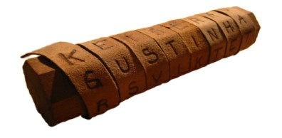
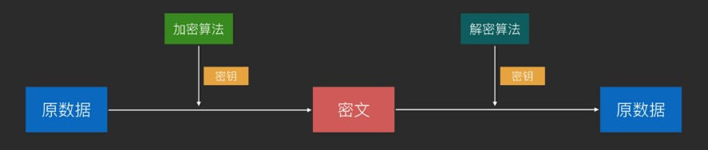
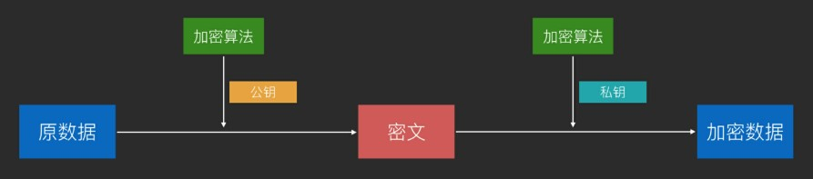
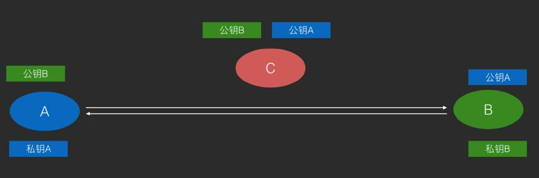
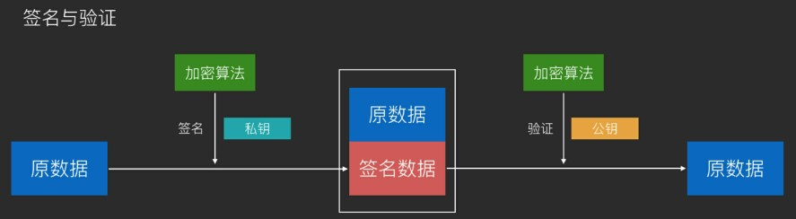
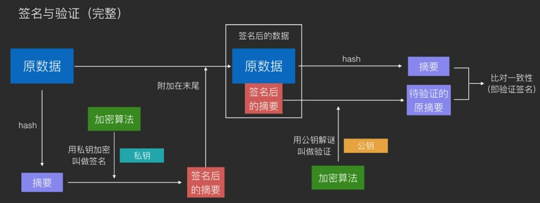
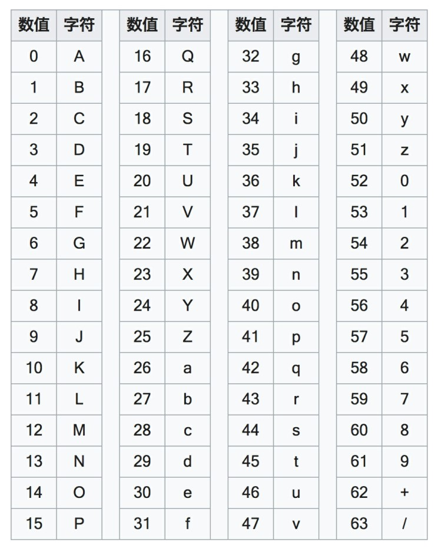
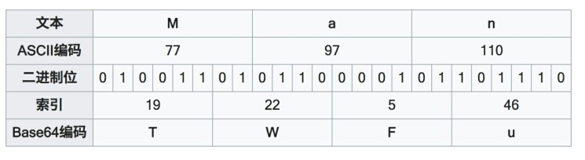
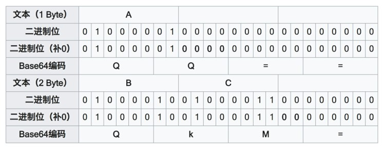

# 加密

### 古典密码学
> 起源于古代战争：在战争中为了防止书信被截获后重要信息泄露，人们开始对书信进行加密
> 

##### 移位式加密
> 如密码棒，使用布条缠绕在木棒上的方式来对书信进行加密。
> 
>
> 加密算法：缠绕后书写
> 密钥：木棒的尺寸

##### 替换式加密
> 按照规则使用不同的文字来替换掉原先的文字来进行加密
>
> 码表：
> 原始字符：ABCDEFGHIJKLMNOPQRESTUVWXXYZ
> 密码字符：BCDEFGHIJKLMNOPQRESTUVWXXYZA
>
> 原始书信：I love you
> 加密书信：j mpwf zpv
> 解读后：I love you
>
> 加密算法：替换文字
> 密钥：替换的码表

### 现代密码学
> 1. 可以加密任何二进制数据
> 2. 非对称加密的出现使得密码学有了更广泛的用途：数字签名
> 

##### 对称加密
> ###### 原理
> 通信双方使用同一密钥，使用加密算法配合上密钥来加密，解密时使用加密过程的完全逆过程配合密钥来进行解密
> 简化模型即上面古典密码学中的替换式加密模型：对文字进行规则化替换来加密，对密文进行逆向的规则化替换来解密
> 
>
> ######  经典算法：
> DES(56位密钥)	AES(128位，192位，256位)
> 现在最流行AES加密，DES因密钥太短而被逐渐弃用
>
> ###### 对称加密的作用：
> 加密通信，防止信息在不安全网络上被截获后，信息被人读取或篡改
>
> ###### 对称加密(如AES)的破解
> **破解思路：**
> 1.拿到一组或多组**原文-密文**对
> 2.设法找到一个密钥，这个密钥可以将这些原文-密文对中的原文加密为密文，以及将密文解密为原文的组合，即为成功破解
> **反破解：**
> 一种优秀的对称加密算法的标准是：让破解者找不到比穷举法更有效的破解手段，并且穷举法的破解时间足够长(例如数千年)
>
> ###### 对称加密的缺点
> 密钥泄露：由于密钥需要传输给对方，所以密钥有泄露风险；一旦密钥泄露，则加密通信失败
>

##### 非对称加密
> ###### 原理
> 使用公钥对数据进行加密得到密文；使用私钥对数据进行解密得到原数据
> 非对称加密使用的是复杂的数学技巧，在古典密码学中没有对应的原型
> 
>
> 使用非对称加密通信，可以在不可信网络上将双方的公钥传给对方，然后在发消息前分别对消息使用对方的公钥来加密和使用自己的私钥来签名，做到不可信网络上的可靠密钥传播及加密通信
> 
>
> 由于公钥和私钥相互可解(不是解出公钥和私钥，而是解出对方加密的数据)，因此非对称加密还可以应用于数字签名技术
> 
>
> 通常会对原数据hash以后对hash签名，然后附加在元数据的后面作为签名。这是为了让数据更小
> 
>
> **A使用A的私钥对原数据的hash签名，B使用A的公钥对签名进行验证**
> **A使用B的公钥对原数据进行加密，B使用B的私钥对密文进行解密**
>
> ###### 经典算法：
>
> RSA(可用于加密和签名)
> DSA(仅用于签名，速度更快)
>
> ###### 优缺点：
>
> - 优点：可以在不安全网络上传输密钥
> - 缺点：计算复杂，因此性能相比对称加密差很多
>
> ###### 非对称加密的破解
>
> **破解思路：**
> 1.和对称加密不同的是，非对称加密的公钥很容易获得，因此制造**原文-密**文对是没有困难的
> 2.所以，非对称加密的关键只在于，如何找到一个正确的私钥，可以解密所有经过公钥加密的密文。找到这样的私钥即为成功破解
> 3.由于非对称加密自身的特性，怎样通过公钥来推断出私钥通常是一种思路(如RSA)，但往往最佳手段依然是穷举法；只是和对称加密破解的区别在于：对称加密破解是不断尝试自己的新私钥是否可以将自己拿到的原文-密文对进行加密和解密，而非对称加密是不断尝试自己的新私钥是否和公钥互相可解
> **反破解：**
> 和对称加密一样非对称加密算法优秀的标准同样在于，让破解者找不到比穷举法更有效的破解手段，并且穷举法的破解时间足够长
> 

### 密码学密钥和登录密码

- 密钥(key)

  场景：用于加密和解密

  目的：保证数据盗取时不会被人读懂内容

  焦点：数据
  
- 登录密码(password)

  场景：用户进入网站或游戏前的身份验证

  目的：数据提供方或应用服务方对账户拥有者数据的保护，保证**你是你**的时候才提供权限

  焦点：身份

# 编码

### Base64
> ##### 定义
> 将二进制数据转换由64个字符组成的字符串编码算法
>
> ##### 什么是二进制数据？
>
> - 广义：所有计算机数据都是二进制数据
> - 狭义：非文本数据即为二进制数据
>
> ##### 算法
>
> 将原数据的ASCII码使用二进制(8位)表示，每6位对应成Base64索引表中的一个字符，然后编排成一个字符串，若原数据长度不是3的倍数时且剩下1个输入数据，则在编码结果后加2个=；若剩下2个输入数据，则在编码结果后加1个=；**每三位原字符转换成4位Base64编码字符，数据会增加1/3**
> **索引表：**
> 
>
> 编码示例：把Man进行Base64编码
> 
>
> 编码示例：Base的末尾补足
> 
> 如果要编码的字节数不能被3整除，最后会多出1个或2个字节，那么可以使用下面的方法进行处理：先使用0字节值在末尾补足，使其能够被3整除，然后再进行Base64的编码。在编码后的Base64文本后加上一个或两个=号，代表补足的字节数。也就是说，当最后剩余两个八位(待补足)字节（2个byte）时，最后一个6位的Base64字节块有四位是0值，最后附加上两个等号；如果最后剩余一个八位(待补足)字节（1个byte）时，最后一个6位的base字节块有两位是0值，最后附加一个等号。
>
> ##### Base64的用途
>
> - 将二进制数据扩充了存储和传输途径(例如：可以把数据保存到本地文件，可以通过聊天对话框或短信形式发送二进制数据，可以在URL中加入简单的二进制数据)
> - 普通的字符串在经过Base64编码后的结果会变得肉眼不可读，因此可以适用于一定条件下的防偷窥(较少用)
>
> ##### Base64的缺点
>
> 因为自身的原理(6位变8位)，因此每次Base64编码之后，数据都会增大约1/3，所以会影响存储和传输性能
>
> **Base64 加密图片传输更安全和⾼效？**
> 这种说法不对，首先，Base64并不是加密；另外，Base64会导致数据增大1/3，降低网络性能，增大用户流量开销，是画蛇添足的表现
> Base对图片进行编码的用处在于，有时需要**用文本形式来传输图片**。除此之外，完全没有必要使用Base64对图片进行额外处理
> 

### 变种：Base58
> 比特币使用的编码方式，去掉了Base64中的数字`0`，大写字母`O`，大写字母`I`，小写字母`l`，以及`+`，`/`，用于比特币地址的表示
>
> Base58对于Base64的改动，主要目的在于用户的便捷性。由于去掉了难以区分的字符，使得Base58对于人工抄写更加方便。另外，去掉`+`，`/`后也让大多数的软件可以方便双击选取
> 

### URL使用的百分号编码
> 在URL的字符串中，对一些不用于特殊用途的保留字符，使用`%`为前缀进行单独编码，以避免出现解析错误。
>
> 例如：要在`http://hencoder.com/users`后面添加查询字符串，查询name为`隐匿&伟大`的用户，如果直接写成`http://hencoder.com/users/?name=隐匿&伟大`,`&`符号会被解析为分隔符号，因此需要对它进行转码，转码后的URL为`http://hencoder.com/users/?name=隐匿%26伟大`。这种编码仅用于URL，目的是避免解析错误的出现
> 

###  压缩和解压缩
>##### 含义
>- 压缩：将数据使用更具有存储优势的编码算法进行编码
>- 解压缩：将压缩数据解码还原成原来的形式，以方便使用
>
>##### 目的
>
>减少数据占用的存储空间
>
>##### 粗暴算法举例：
>
>将下面文本内容压缩：
>`aaaaaaaaaaaaaaaaaaaaaaaaaaaaaaaaaaaaaaaaaaaaaaaaaaaaaaaaaaaaaaaaaaaaaaaaaaaaaaaaaaaaaaaaaaaaaaaaaaaaaaaaaaaaaaaaaaaaaaaaaaaaaaaaaaaaaaaaaaaaaaaaaaaaaaaaaaaaaaaaaaaaaaaaaaaaaaaaaaaaaaaaaaaaaaaaaaaaaaaaaaaaaaaaaaaaaaaaaaaaaaaaaaaaaaaaaaaaaaaaaaaaaaaaaaaaaaaaaaaaaaaaaaaaaaaaaaaaaaaaaaaaaaaaaaaaaaaaaaaaaaaaaaaaaaaaaaaaaaaaaaaaaaaaaaaaaaaaaaaaaaaaaaaaaaaaaaaaaaaaaaaaaaaaaaaaaaaaaaaaaaaaaaaaaaaaaaaaaaaaaaaaaaaaaaaaaaaaaaaaaaaaaaaaaaaaaaaaaaaaaaaaaaaaaaaaaaaaaaaaaaaaaaaaaaaaaaaaaaaaaaaaaaaaaaaaaaaaaaaaaaaaaaaaaaaaaaaaaaaaaaaaaaaaaaaaaaaaaaaaaaaaaaaaaaaaaaaaaaaaaaaaaaaaaaaaaaaaaaaaaaaaaaaaaaaaaaaaaaaaaaaaaaaaaaaaaaaaaaaaaaaaaaaaaaaaaaaaaaaaaaaaaaaaaaaaaaaaaaaaaaaaaaaaaaaaaaaaaaaaaaaaaaaaaaaaaaaaaaaaaaaaaaaaaaaaaaaaaaaaaaaaaaaaaaaaaaaaaaaaaaaaaaaaaaaaaaaaaaaaaaaaaaaaaaaaaaaaaaaaaaaaaaaaaaaaaaaaaaaaaaaaaaaaaaaaaaaaaaaaaaaaaaaaaaaaaaaaaaaaaaaaaaaaaaaaaaaaaaaaaaaaaaaaaaaaaaaaaaaaaaaaaaaaaaaaaaaaaaaaaaaaaaaaaaaaaaaaaaaaaaaaaaaaaaaaaaaaaaaaaaaaaaaaaaaaaaaaaaaaaaaaaaaaaaaaaaaaaaaaaaaaaaaaaaaaaaaaaaaaaaaaaaaaaaaaaaaaaaaaaaaaaaaaaaaaaaaaaaaaaaaaaaaaaaaaaaaaaaaaaabbbbbbbbbbbbbbbbbbbbbbbbbbbbbbbbbbbbbbbbbbbbbbbbbbbbbbbbbbbbbbbbbbbbbbbbbbbbbbbbbbbbbbbbbbbbbbbbbbbbbbbb`
>使用某种算法压缩后的数据为： `compress:a:1062;b:105`    注意：具体的压缩场景有许多，因此压缩算法也会复杂得多，上面只是一个原型算法
>
>##### 压缩是编码么？
>
>是，所谓编码，即把数据从一种形式转换为另一种形式。压缩过程属于编码过程，解压缩过程属于解码过程
>
>##### 常见压缩算法
>
>DEFLATE，JPEG，MP3等
>

### 图片与音频，视频编解码
> ##### 含义
> 将图片，音频，视频数据通过编码来转换成存档形式(编码)，以及从存档形式转换回来(解码)
>
> ##### 目的
> 存储和压缩媒体数据(大多数媒体编码算法会压缩数据，但不是全部)
>
> ##### 图片压缩粗暴算法举例
> 一张纯白(白色的16进制数值为0xffffff)的64×64不透明像素图片，原数据格式大致为：
> `width:64;height:64;ffffffffffffffffffffffffffffffffffffffffffffffffffffffffffffffffffffffffffffffffffffffffffffffffffffffffffffffffffffffffffffffffffffffffffffffffffffffffffffffffffffffffffffffffffffffffffffffffffffffffffffffffffffffffffffffffffffffffffffffffffffffffffffffffffffffffffffffffffffffffffffffffffffffffffffffffffffffffffffffffffffffffffffffffffffffffffffffffffffffffffffffffffffffffffffffffffffffffffffffffffffffffffffffffffffffffffffffffffffffffffffffffffffffffffffffffffffffffffffffffffffffffffffffffffffffffffffffffffffffffffffffffffffffffffffffffffffffffffffffffffffffffffffffffffffffffffffffffffffffffffffffffffffffffffffffffffffffffffffffffffffffffffffffffffffffffffffffffffffffffffffffffffffffffffffffffffffffffffffffffffffffffffffffffffffffffffffffffffffffffffffffffffffffffffffffffffffffffffffff.......ffffff`
> 使用某种算法压缩后的数据为：`width:64;height:64;ffffff:[0,0]-[63,63]`    注意：具体的压缩场景有许多，因此压缩算法也会复杂得多，上面只是一个原型算法
>
> ⾳频与视频的编码与上面的图片编码同理。
> 

# 序列化
> 把数据对象(一般是内存中的，例如JVM中的对象)转换成字节序列的过程。**对象在程序内存里的存放形式是散乱的(存放在不同的内存区域，并且由引用进行连接)**，通过序列化可以把内存中的对象转换成一个字节序列，从而使用`byte[]`等形式进行本地存储或网络传输，在需要的时候重新组装(反序列化)来使用
>
> ### 目的
> 让内存中的对象可以被存储和传输
>
> ### 序列化是编码么?
> 不是，编码是把数据由一种数据格式转换成另一种数据格式；而序列化是把数据由内存中的对象(而不是某种具体的数据格式)转换成字节序列
>

# Hash
> ### 定义
>
> 把任意数据转换成指定大小范围(通常很小，例如256字节以内)的数据
>
> ### 作用
>
> 相当于从数据中提取出摘要信息，因此最主要用途是数字指纹
>
> ### 用途
>
> **1. 唯一性验证**    例如Java中的hashCode方法
> **怎么重写hashCode方法？**
> 把equals方法中每个用于判断相等的变量都放进hashCode()中，一起生成一个尽量不会碰撞的整数即可
> **为什么每次重写equals()都需要重写hashCode()？**
> 因为要把新的判断条件放进hashCode()中
>
> **2.数据完整性验证**
> 从网络上下载文件后，通过对比文件的hash值(如MD5，SHA1)，可以确认下载的文件是否有损坏。如果下载文件的hash值和文件提供方给出的hash值一致，则证明下载的文件是完好无损的
>
> **3.快速查找**
> HashMap    会先用hashCode()进行判断，如果相同，再调用equals()进行判断
>
> **4.隐私保护**
> 当重要数据需要暴露时，有时可以选择暴露它的hash值(例如MD5)，以保障原数据的安全。例如网站登录时，可以只保存用户密码的hash值，在每次登录验证时只需要将输入的密码的hash值和数据库中保存的Hash值做比较就好，网站无需知道用户的密码。这样，当网站数据失窃时，用户不会因为自己的密码被盗导致其它网站的安全也会受到威胁
>
> ### Hash是编码么？
>
> **不是**，Hash是单向过程，往往是不可逆的，无法进行逆向恢复操作，因此Hash不属于编码
>
> ### Hash是加密吗？
>
> 不是，Hash是单向过程，无法进行逆向恢复操作，因此Hash不属于加密。(**MD5不是加密**)
> 

# 字符集
> ### 含义
> 一个由整数向现实世界中的文字符号的Map
>
> ### 分支
> - ASCII：128个字符
> - ISO-8859-1：对ASCII进行扩充
> - Unicode：13万个字符集
>     - UTF-8：Unicode编码分支
>     - UTF-16：Unicode编码分支
> -   GBK/GB2312/GB18030：中国自研标准，多字节，字符集+编码
> 
