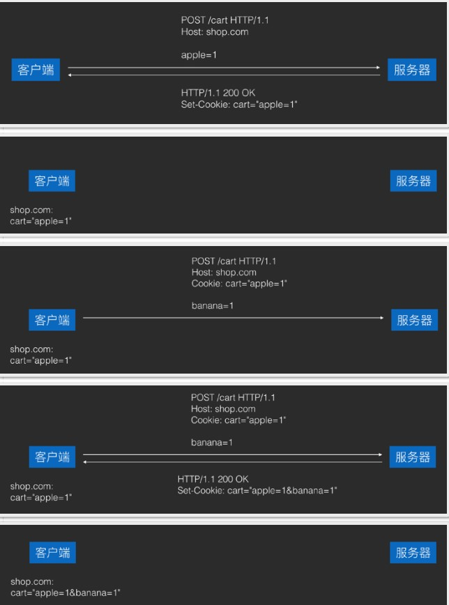
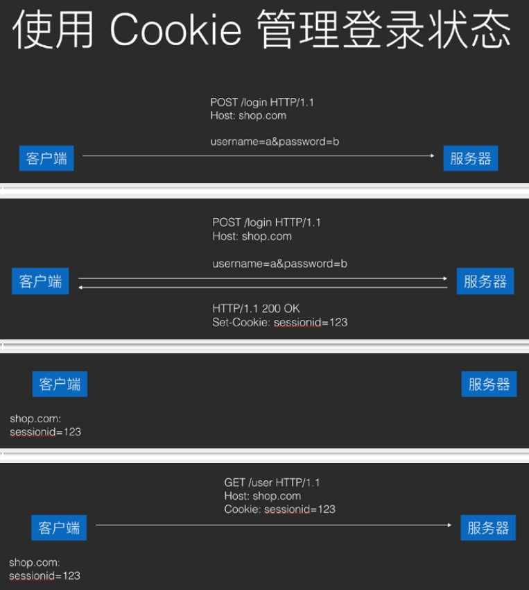
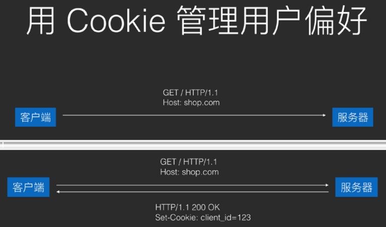
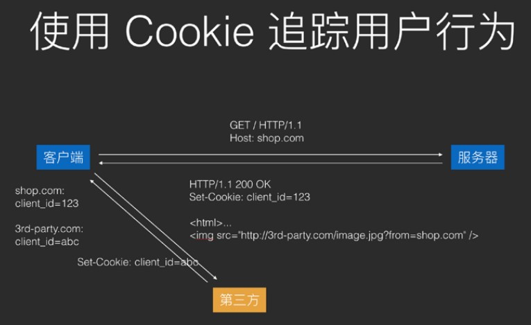

# 登录和第三方授权

### 登录和授权
> 登录：身份认证，即确认你是你的过程
>
> 授权：由身份或持有令牌确认享有某些权限权限(例如获取用户信息)，而登录过程实质上的目的也是为了确认权限
>
> 总结：在实际应用中，多数场景下的登录和授权界限是模糊的
> 

### HTTP中授权方式
> Cookie和Authorization Header
> 

### Cookie
> ##### 起源
>
> 源于购物车功能的需求，由Netscape浏览器开发团队打造
>
> ##### 工作机制
>
> 1. 服务器需要客户端保存的内容放在`Set-Cookie` headers里返回，客户端会自动保存
> 2. 客服端保存的Cookies，会在之后请求相同服务器的所有请求里都携带进`Cookie`header里返回给服务器
> 3. 客服端保存Cooki是按照服务器域名来分类的，例如shop.com发回的Cookie保存下来以后，在之后games.com的请求中并不会携带
> 4. 客户端保存的Cookie在超时后会被删除，没有设置超时时间的Cookie(简称Session Cookie)在浏览器关闭之后就会自动删除；另外，服务器也可以主动删除还未过期的客户端Cookies
> 
>
> ##### 作用
>
> 1. 会话管理：登录状态，购物车
> 
> 2. 个性化：用户偏好，主题
> 
> 
> 3. Tracking：分析用户行为
> 
>
> ##### XSS(Cross-site scripting)
>
> **跨站脚本攻击：**使用JavaScript拿到浏览器的Cookie之后，发送到自己的网站，以这种方式来盗取用户的Cookie。应对方式：Server在发送Cookie时，敏感的Cookie加上HttpOnly
> **HttpOnly：**这个Cookie只能用于HTTP请求，不能被JavaScript调用。它可以防止本地代码滥用Cookie
>
> ##### XSRF(Cross-site request forgery)
>
> **跨站请求伪造：**在用户不知情的情况下访问已经保存了Cookie的网站，以此来越权操作用户账户(例如盗取用户资金)，应对方式主要是从服务器安全角度考虑
> **Referer：**Referer校验，访问来源识别
> 

### Authorization

> ##### 方式
>
> Basic 和 Bearer
>
> ##### Basic
>
> 格式：Authorization: Basic <username : password(Base64ed)>
>
> ##### Bearer
>
> 格式：Authorization: Bearer <bearer token>
> bearer token的获取方式：通过OAuth2的授权流程
>
> ##### OAuth2流程
>
> 1. 第三方网站向授权方网站申请第三方授权合作，拿到client_id和client_secret
> 2. 用户在使用第三方网站时，点击通过XX(如Github)授权按钮，第三方网站将页面跳转到授权方网站，并传入client_id作为自己的身份标识
> 3. 授权方根据client_id，将第三方网站的信息和第三方网站需要的用户权限展示给用户，并询问用户是否同意授权
> 4. 用户点击同意授权按钮后，授权方网站将页面跳转回第三方网站，并传入Authorization Code作为用户认可的凭证
> 5. 第三方网站将Authorization Code发送回自己的服务器
> 6. 服务器将Authorization Code和自己的client_secret一并发送给授权方的服务器，授权方服务器在验证通过后，返回access token。OAuth流程结束
> 7. 在上面的过程结束后，第三方网站的服务器(有时客户端也会)就可以使用access token作为用户授权的令牌，向授权方网站发送请求来获取用户信息或操作用户账户。但这已经在OAuth流程之外
>
> 为什么OAuth要引入Authorization Code，并需要申请授权的第三方将Authorization Code发送回自己的服务器，再从服务器来获取access token，而不是直接返回access token呢？这样复杂的流程意义何在？
>
> > 为了安全，OAuth不强制授权流程必须使用HTTPS，因此需要保证当通信路径中存在窃听者时，依然具有足够高的安全性
>
> ##### 第三方App通过微信登录流程
>
> 1. 第三方App向腾讯申请第三方合作授权，拿到client_id和client_secret
> 2. 用户在使用第三方App时，点击通过微信登录，第三方App将使用微信SDK跳转到微信，并传入自己的client_id作为自己的身份标识
> 3. 微信通过和服务器交互，拿到第三方App的信息，并限制在界面中，然后询问用户是否同意授权该App使用微信来登录
> 4. 用户点击使用微信登录后，微信和服务器交互将授权信息交互，然后跳转回第三方App，并传入Authorization Code作为用户得到认可的凭证
> 5. 第三方App调用自己服务器的微信登录Api，并传入Authorization Code，然后等待服务器的响应
> 6. 服务器在收到登录请求后，拿到上传的Authorization Code去向微信的第三方授权接口发送请求，将Authorization Code和自己的client_secret一起作为参数发送，微信在验证通过后，返回access token
> 7. 服务器在收到access token后，立即拿着access token去向微信的用户信息接口发送请求，微信验证通过后，返回用户信息
> 8. 服务器在收到用户信息后，在自己的数据库中为用户创建一个账户，并使用从微信服务器拿到的用户信息填入自己的数据库，并将用户的id和用户为微信id做关联
> 9. 用户创建完成后，服务器向客户端的请求做出响应，传送回刚才创建好的用户信息
> 10. 客户端收到服务器的响应，用户登录成功
>
> ##### 在自家App中使用Bearer token
>
> 有的App会在Api的设计中，将登录和授权设计成类似OAuth2的过程，但简化掉Authorization Code概念。即：登录接口请求成功时，会返回access token，然后客户端在之后的请求中，就可以使用这个access token来当做bearer token进行用户操作
>
> ##### Refresh token
>
> ```json
> {
> 	"token_type": "Bearer",
> 	"access_token": "xxxxx",
> 	"refresh_token": "xxxxx",
> 	"expire_time":"xxxxx"
> }
> ```
>
> **用法：**`access token`有失效时间，在它失效后，调用`refresh token`接口，并传入`refresh token`来获取新的`access token`
>
> **目的：** 安全，当access token失窃时，由于它有实效时间，因此坏人只有较短的时间来做坏事；同时，由于(在标准的OAuth2流程中) refresh token永远只存在于第三方服务的服务器中，因此refresh token几乎没有失窃的风险
