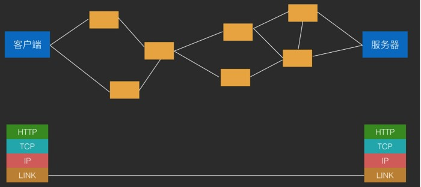
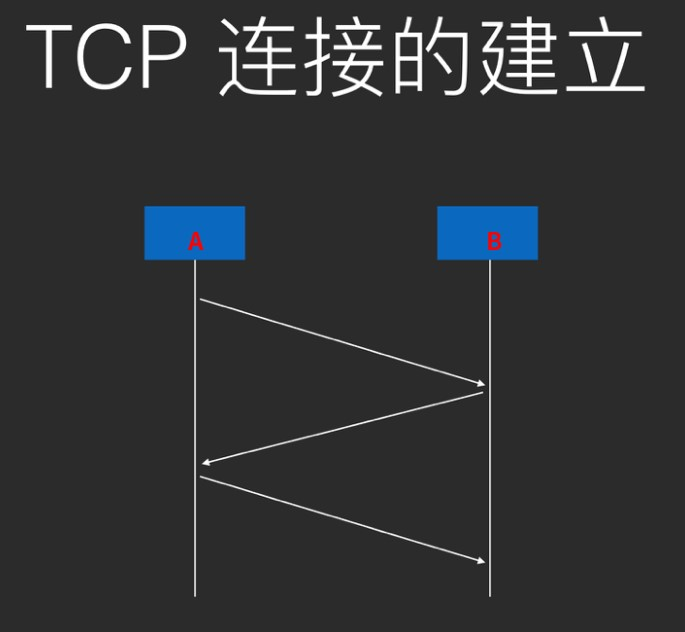
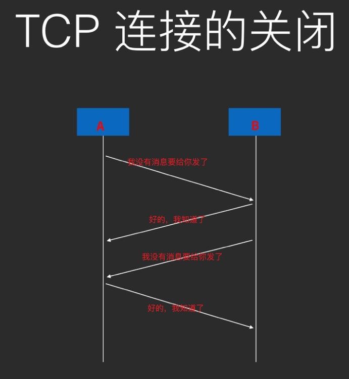

# TCPIP和HTTPS

### TCP/IP协议族

##### 概念
> 一些列协议所组成的一个网络分层模型
> 

##### 为什么要分层
> 因为网络的不稳定性
> 各层功能独立，通用，封装

##### 具体分层
> **四层模型：**
>
> - Application Layer  应用层(应用间交互)：**HTTP**(超文本传输协议)，**FTP**(文件传输协议)，**DNS**(域名解析)
> - Transport Layer  传输层(数据分块，组装)：**TCP**(可靠的面向连接的，保证数据的到达)，**UDP**(无连接，不可靠，尽力而为的服务)
> - Internet Layer  网络层(数据传输)：**IP**
> - Link Layer  数据链路层(将网络层的数据封装成帧)：**以太网**，**Wi-Fi**
> 
>
> **七层模型：**
>
> - 应用层  表示层  会话层  传输层  网络层  数据链路层  物理层
> 

##### TCP连接
> HTTP无状态(传输前已经认识)
> TCP有状态(建立连接，相互认识)
> Socket(端口来认识，套接字来收发消息)
>
> **什么叫做连接**
> 通信双方建立确认**可以通信**，不会将对方的消息丢弃，即为**建立连接**
>
> **TCP连接的建立**

> 
> 
> **TCP连接的关闭**

> 

##### 长连接
> 为什么要长连接？
>
> 因为移动网络并不在Internet中，而是在运营商的内网，并不具有真正的公网IP，因此当某个TCP连接在一段时间内不通信时，网关会出于网络性能考虑而关闭这条TCP连接和公网的连接通道，导致这个TCP端口不能收到外部通信消息，即TCP连接被动关闭
>
> 长连接实现的方式
>
> 心跳。即在一定时间间隔内，使用TCP连接发送超短无意义消息来让网关不能将自己定义为空闲连接，从而防止网关将自己的连接关闭
> 

### HTTPS
> 为什么HTTPS是安全的，HTTP是不安全的?
> HTTPS一定安全么？
> HTTP一定不安全么？
> 如何实现让HTTP像HTTPS一样的安全效果？

##### 定义

>HTTP over SSL的简称，即工作在SSL(或TLS)上的HTTP。说白了就是加密通信的HTTP
>

##### 工作原理
> 在客户端和服务器之间协商出一套对称密钥，每次发送消息之前将内容加密，收到之后解密，达到内容的加密传输
> 

##### 为什么不直接用非对称加密
> 非对称加密由于使用了复杂的数学原理，因此计算相当复杂，如果完全使用非对称加密来加密通信内容，会严重影响网络通信的性能
> 

##### HTTPS连接建立的过程(证书验证)
> 1. Client Hello
> 2. Server Hello
> 3. 服务器证书  信任建立
> 4. Pre-master Secret
> 5. 客户端通知：将使用加密通信
> 6. 客户端发送：Finished
> 7. 服务器通知：将使用加密通信
> 8. 服务器发送：Finished
> 

##### 在Android中使用HTTPS
> 正常情况：直接使用
>
> ###### 需要自己写证书验证过程的场景
>
> - 使用的是自签名证书(例如：只用于内网的https)
> - 证书信息不全，缺乏中间证书机构(可能性不大)
> - 手机操作系统较旧，没有安装最新加入的根证书
> 
