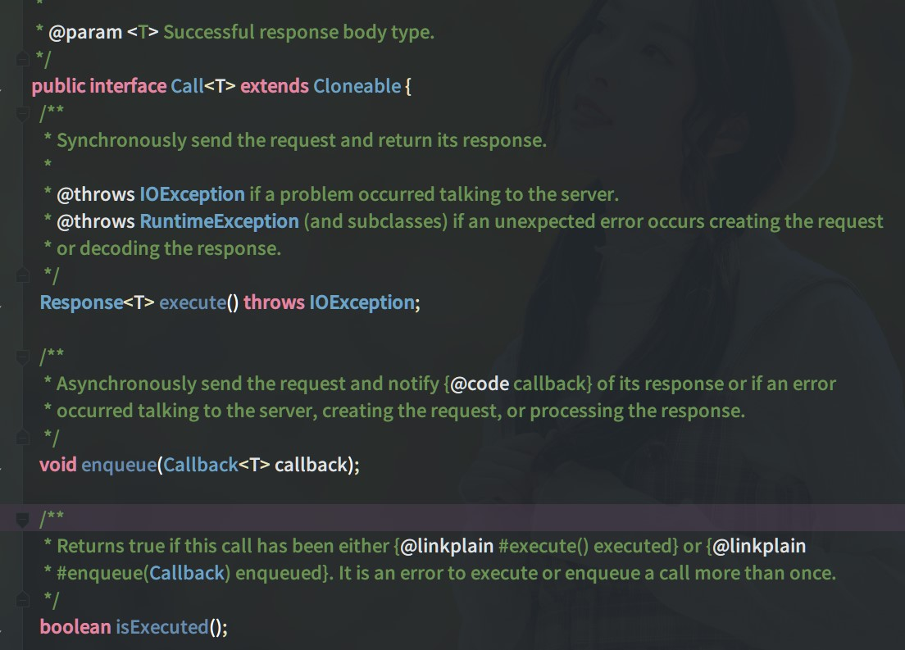

# 从Retrofit的原理来看HTTP

### Retrofit的简单使用
> 1. 添加依赖
>
> ```groovy
> implementation 'com.squareup.retrofit2:retrofit:2.6.0'
> implementation 'com.squareup.retrofit2:adapter-rxjava2:2.6.0'
> implementation 'com.squareup.retrofit2:converter-gson:2.6.0'
> ```
>
>
> 2.  创建一个interface作为Web Service的请求集合，在上面用注解写入需要配置的请求方法
>
> ```kotlin
> interface GithubService {
> @GET("/users/{user}/repos")
> 	fun listRepos(@Path("user") user: String): Call<List<Repo>>
> }
> ```
> 3. 获取Retrofit实例(单例对象)
>
> ```kotlin
> object Net {
> fun instance() =
> 	Retrofit.Builder()
>    		.addConverterFactory(GsonConverterFactory.create())
>    		.baseUrl("https://api.github.com/")
>    		.build()
> }
> ```
> 4. 创建出Service interface实例，调用对应的接口方法，创建出相应的可以用来发起网络请求的Call对象
>
> ```kotlin
> val githubService = Net.instance().create(GithubService::class.java)
> val listRepos = githubService.listRepos("hsicen")
> ```
>
> 5.    使用Call.execute()或者Call.enqueue()发起请求
>
> ```kotlin
> listRepos.enqueue(object : Callback<List<Repo>> {
> 	override fun onFailure(call: Call<List<Repo>>, t: Throwable) {
> 		tv_content.text = t.message
> 	 }
> 
> 	override fun onResponse(call: Call<List<Repo>>, response: Response<List<Repo>>) {
> 		tv_content.text = response.body().toString()
> 	 }
> })
> ```
>

###  Retrofit源码分析
> 首先我们从离我们最近的位置作为切入点(通常是业务代码的最后一行)，这里我们点进Call.enqueue()，看看里面的代码逻辑
>
> 
>
> 发现这是一个接口，没有具体实现，切入失败；现在需要逐步回退寻找到下一个切入点`Retrofit.create()`
>
> ```java
> public <T> T create(final Class<T> service) {
> 	Utils.validateServiceInterface(service);  //接口验证
> 	if (validateEagerly) {eagerlyValidateMethods(service);}  //提前验证所有方法的正确性，会用到反射
> 	
> 	//动态代理  创建一个运行时的类，Interface的每一个方法调用都会交由InvocationHandler来处理            
> 	return (T) Proxy.newProxyInstance(service.getClassLoader(), new Class<?>[] { service },
>       new InvocationHandler() {
> 		private final Platform platform = Platform.get();
> 		private final Object[] emptyArgs = new Object[0];
> 		
> 		@Override public @Nullable Object invoke(Object proxy, Method method,
> 		@Nullable Object[] args) throws Throwable {
> 	// If the method is a method from Object then defer to normal invocation.
> 	if (method.getDeclaringClass() == Object.class) {//继承自Object的方法
> 		return method.invoke(this, args);
> }
> if (platform.isDefaultMethod(method)) {  //接口默认方法 Java8
> 		return platform.invokeDefaultMethod(method, service, proxy, args);
> }
> 
> //关键代码
> return loadServiceMethod(method).invoke(args != null ? args : emptyArgs);
> 	}
> 	});
> }
> ```
>
> 可以看到前面两行是代码健壮性验证，**核心代码**是`Proxy.newProxyInstance()`方法来创建Service实例。这个方法会为参数中的Interface创建一个对象，这个对象实现了Interface的每个方法，并且每个方法的实现都会雷同的：调用对象实例内部的一个`InvocationHandler`成员变量的invoke方法，并把自己的方法信息传递进去。这样就在实质上实现了代理逻辑；Interface中的方法全部由一个另外设定的InvocationHandler对象来进行代理操作。并且这些方法的具体实现是在运行时生成Interface实例时才确定的，而不是在编译时。这就是动态代理机制，大致像下面这样：
>
> ```kotlin
> //GithubService.kt
> interface GithubService {
> 	@GET("/users/{user}/repos")
> 	fun listRepos(@Path("user") user: String): Call<List<Repo>>
> 
> 	@GET("/users/hsicen")
> 	fun getUser(): Call<User>
> }
> 
> //realService
> class RealService : GithubService {
> private val invocationHandler = object : InvocationHandler {
> private val platform = Platform.get();
> 
> override fun invoke(proxy: Any?, method: Method?, args: Array<out Any>?): Any {
> //扮演代理角色，对不同的方法做不同的处理
> 
> return Any()
> }
> }
> 
> override fun listRepos(user: String): Call<List<Repo>> {
> val method = GithubService::class.java.getMethod("listRepos")
> return invocationHandler.invoke(this, method, null) as Call<List<Repo>>
> }
> 
> override fun getUser(): Call<User> {
> val method = GithubService::class.java.getMethod("getUser")
> return invocationHandler.invoke(this, method, null) as Call<User>
> }
> }
> ```
>
> 接下主要关注`loadServiceMethod(method).invoke(args != null ? args : emptyArgs)`这句代码，`loadServiceMethod()`和`invoke()`是这个方法中关键作用的代码；`invoke()`就是Retrofit创建Service实例的关键
>
> ```java
> abstract @Nullable T invoke(Object[] args);
> ```
>
> 点进去发现，这是ServiceMethod的抽象方法；那么只好看看loadServiceMethod方法的具体逻辑
>
> ```java
> ServiceMethod<?> loadServiceMethod(Method method) {
> 	ServiceMethod<?> result = serviceMethodCache.get(method);
> 	if (result != null) return result;
> 	synchronized (serviceMethodCache) {
> 		result = serviceMethodCache.get(method);
> 			if (result == null) {
> 				result = ServiceMethod.parseAnnotations(this, method);
> 				serviceMethodCache.put(method, result);
> 		}
> 	}
> 	return result;
> }
> ```
>
> 然后再点进`ServiceMethod.parseAnnotations()`方法
>
> ```java
> static <T> ServiceMethod<T> parseAnnotations(Retrofit retrofit, Method method) {
> RequestFactory requestFactory = RequestFactory.parseAnnotations(retrofit, method);
> 
> Type returnType = method.getGenericReturnType();
> if (Utils.hasUnresolvableType(returnType)) {
> throw methodError(method,
> "Method return type must not include a type variable or wildcard: %s", returnType);
> }
> if (returnType == void.class) {
> throw methodError(method, "Service methods cannot return void.");
> }
> 
> return HttpServiceMethod.parseAnnotations(retrofit, method, requestFactory);
> }
> ```
>
> 在这个方法中主要看`HttpServiceMethod.parseAnnotations()`，这个方法的代码就比较多了，我们主要看返回处的代码
>
> ```java
> if (!isKotlinSuspendFunction) {
> return new CallAdapted<>(requestFactory, callFactory, responseConverter, callAdapter);
> } else if (continuationWantsResponse) {
> //noinspection unchecked Kotlin compiler guarantees ReturnT to be Object.
> return (HttpServiceMethod<ResponseT, ReturnT>) new SuspendForResponse<>(requestFactory,
> callFactory, responseConverter, (CallAdapter<ResponseT, Call<ResponseT>>) callAdapter);
> } else {
> //noinspection unchecked Kotlin compiler guarantees ReturnT to be Object.
> return (HttpServiceMethod<ResponseT, ReturnT>) new SuspendForBody<>(requestFactory,
> callFactory, responseConverter, (CallAdapter<ResponseT, Call<ResponseT>>) callAdapter,
> continuationBodyNullable);
> }
> ```
>
> `HttpServiceMethod`是 `ServiceMethod`的子类，而``HttpServiceMethod.parseAnnotations()``是返回ServiceMethod对象，然后再执行ServiceMethod的invoke方法，这里我们可以直接查看HttpServiceMethod的invoke方法
>
> ```java
> @Override final @Nullable ReturnT invoke(Object[] args) {
> Call<ResponseT> call = new OkHttpCall<>(requestFactory, args, callFactory, responseConverter);
> return adapt(call, args);
> }
> ```
>
> 在invoke()中创建了一个OkHttpCall，然后调用了adapt()方法，返回我们需要的对象，那么我们就来看这个adapt()方法干了什么，继续点进去
>
> ```java
> protected abstract @Nullable ReturnT adapt(Call<ResponseT> call, Object[] args);
> ```
>
> 又是一个抽象方法，看来直接查看adapt()方法行不通，那么就只好看看OkHttpCall做了什么了，我们点进OkHttpCall看一下吧
>
> ```java
> final class OkHttpCall<T> implements Call<T> {
> 	.......
> }
> ```
>
> OkHttpCall是继承自Retrofit的Call的，也就是我们第一步没走通的那个Call，那么它有没有实现Call的enqueue()呢？
>
> ```java
> @Override public void enqueue(final Callback<T> callback) {
> 	okhttp3.Call call;
> 	synchronized (this) {
> 		call = rawCall;
> 		if (call == null && failure == null) {
> 			call = rawCall = createRawCall();
> 		}
> 	}
> 
> 	call.enqueue(new okhttp3.Callback() {
> 		@Override public void onResponse(okhttp3.Call call, okhttp3.Response rawResponse) {
> 			Response<T> response = parseResponse(rawResponse);
> 			 callback.onResponse(OkHttpCall.this, response);
> 		}
> 
> 		@Override public void onFailure(okhttp3.Call call, IOException e) {
> 			callFailure(e);
> 		}
> 	});
> }
> ```
>
> 由于enqueue()中代码量较大，我精简了这部分代码，enqueue()主要的工作是创建了一个okhttp3的Call，然后调用这个call的enqueue()方法去发起网络请求，然后将回调结果预处理之后，交由Retrofit的Callback
>
> 因此，到这里我们对Retrofit的工作流程就有了一个大致的了解，Retrofit通过动态代理创建出Service实例，然后通过这个实例调用对应的api得到一个Retrofit的Call对象，这个Call对象又创建了一个OkHttp3的Call实例去发起网络请求，然后将结果回调给Retrofit的Callback
>
> 在上面的分析过程中，有一个点还没有解决，那就是我们在创建出OkHttpCall对象后，然后调用了adapt()方法，这个adapt()方法是干什么用的呢？做了哪些处理？
>
> 在工作中我们知道，adapter是适配器的意思，作为中间桥梁的作用；猜测是不是对OkHttpCall的转换处理呢？因为我们知道Retrofit可以和RxJava结合使用，是不是就是因为这个adapt()的作用呢？当然，我们还需要查看源码，才能找到答案
>
> 找到刚才那个抽象的adapt()方法，查看其实现的地方，我们会看到HttpServiceMethod内部有一个静态内部类实现了该抽象方法
>
> ```java
> static final class CallAdapted<ResponseT, ReturnT> extends HttpServiceMethod<ResponseT, ReturnT> {
> private final CallAdapter<ResponseT, ReturnT> callAdapter;
> 
> CallAdapted(RequestFactory requestFactory, okhttp3.Call.Factory callFactory,
> Converter<ResponseBody, ResponseT> responseConverter,
> CallAdapter<ResponseT, ReturnT> callAdapter) {
> super(requestFactory, callFactory, responseConverter);
> this.callAdapter = callAdapter;
> }
> 
> @Override protected ReturnT adapt(Call<ResponseT> call, Object[] args) {
> return callAdapter.adapt(call);
> }
> }
> ```
>
> 在这个类中，创建了一个CallAdapter类，并将adapt()交由CallAdapter的adapt()来实现，这时候我们可以联想到在Retrofit初始化的时候，有这么一句代码 `addCallAdapterFactory(RxJava2CallAdapterFactory.create())`,加上这句代码后，我们就可以将Call对象转化为Observable对象，和RxJava进行交互了，看来这个adapt()方法很可能就是将OkHttpCall进行转换的作用，为了验证我们的猜想，继续深入源码分析
>
> 这个静态内部类的callAdapter是构造方法传进来的，我们一步一步的向上找
> 	CallAdapted -> callAdapter
> 	HttpServiceMethod -> createCallAdapter()
> 	Retrofit -> callAdapter()
> 	Retrofit -> nextCallAdapter()  callAdapterFactories.get()
> 最后我们发现CallAdapter来自callAdapterFactories变量，那么我们现在就需要找到callAdapterFactories的来源 
>
> ```java
> // Make a defensive copy of the adapters and add the default Call adapter.
> List<CallAdapter.Factory> callAdapterFactories = new ArrayList<>(this.callAdapterFactories);
> callAdapterFactories.addAll(platform.defaultCallAdapterFactories(callbackExecutor));
> ```
>
> 我们可以发现这个callAdapterFactories分了两次添加，一次是callAdapterFactories变量，另一次是和平台相关的默认CallAdapterFactories，我们先看这个和平台相关默认的CallAdapterFactories，我们这里就只看Android平台
>
> ```java
> @Override List<? extends CallAdapter.Factory> defaultCallAdapterFactories(
> @Nullable Executor callbackExecutor) {
> if (callbackExecutor == null) throw new AssertionError();
> DefaultCallAdapterFactory executorFactory = new DefaultCallAdapterFactory(callbackExecutor);
> return Build.VERSION.SDK_INT >= 24
> ? asList(CompletableFutureCallAdapterFactory.INSTANCE, executorFactory)
> : singletonList(executorFactory);
> }
> ```
>
> 首先声明了一个Executor，看命名，这个Executor是用于回调的；然后创建了DefaultCallAdapterFactory(),我们点进这个类，看它的get()方法做了什么操作
>
> ```java
> @Override public @Nullable CallAdapter<?, ?> get(Type returnType, Annotation[] annotations, Retrofit retrofit) {
> return new CallAdapter<Object, Call<?>>() {
> @Override public Type responseType() {
> return responseType;
> }
> 
> @Override public Call<Object> adapt(Call<Object> call) {
> return executor == null
>    ? call
>    : new ExecutorCallbackCall<>(executor, call);
> }
> };
> }
> ```
>
> 我只截取了核心代码，我们可以看到在get()方法中返回了一个CallAdapter，还有一点应该注意，我们找这个CallAdapter的原因是什么，是不是要弄清楚它的adapt()方法做了什么，刚开始由于CallAdapter的adapt()是抽象方法，所以我们找到了现在这里；那么，现在我们可以看到DefaultCallAdapterFactory类的get()方法返回的是一个CallAdapter，在它的adapt()方法里返回了ExecutorCallbackCall对象，还记得OkHttpCall么？当时OkHttpCall是通过adapt(call)方法传进来的，DefaultCallAdapterFactory类里又原封不动的传给了ExecutorCallbackCall类，现在ExecutorCallbackCall对象做了什么处理
>
> ```java
> static final class ExecutorCallbackCall<T> implements Call<T> {
> 	final Executor callbackExecutor;
> 	final Call<T> delegate;
> 	
> 	ExecutorCallbackCall(Executor callbackExecutor, Call<T> delegate) {
> 		this.callbackExecutor = callbackExecutor;
> 		this.delegate = delegate;
> 	}
> 
> 	@Override public void enqueue(final Callback<T> callback) {
> 	    delegate.enqueue(new Callback<T>() {
> 	         @Override public void onResponse(Call<T> call, final Response<T> response) {
>                callbackExecutor.execute(new Runnable() {
>                         @Override public void run() {
>                               if (delegate.isCanceled()) {
>        // Emulate OkHttp's behavior of throwing/delivering an IOException on cancellation.
>                                       callback.onFailure(ExecutorCallbackCall.this, new IOException("Canceled"));
>                               } else {
> 	                                   callback.onResponse(ExecutorCallbackCall.this, response);
> 			}
>    	}
>    });
> }
> 
> @Override public void onFailure(Call<T> call, final Throwable t) {
>  callbackExecutor.execute(new Runnable() {
>    @Override public void run() {
>      callback.onFailure(ExecutorCallbackCall.this, t);
>    }
>  });
> }
> });
> }
> }
> ```
>
> 可以看到，ExecutorCallbackCall是DefaultCallAdapterFactory的静态内部类，继承自Retrofit的Call，与OkHttpCall是同类的，它的作用是把操作切回主线程后再交给Callback
>
> 分析完这个和平台相关的默认CallAdapter，我们再来看看callAdapterFactories变量中的CallAdapter，我们点击callAdapterFactories变量，看看哪里对它进行了添加操作
>
> ```java
> public Builder addCallAdapterFactory(CallAdapter.Factory factory) {
> callAdapterFactories.add(checkNotNull(factory, "factory == null"));
> return this;
> }
> 
> fun instance(): Retrofit =
> Retrofit.Builder()
>    .addConverterFactory(GsonConverterFactory.create())
>    .addCallAdapterFactory(RxJava2CallAdapterFactory.create())
>    .baseUrl("https://api.github.com/")
>    .build()
> ```
>
> 这些就明白了，这个CallAdapter是我们初始化Retrofit时我们主动添加进去的，我们这里添加的CallAdapterFactory是和RxJava结合使用的，像下面这样
>
> ```kotlin
> //GithubService.kt
> @GET("/users/{user}/repos")
> fun listRepos(@Path("user") user: String): Observable<List<Repo>>
> 
> //发起网络请求
> val repoService = Net.instance().create(GithubService::class.java)
> repoService.listRepos("hsicen")
> 	.observeOn(Schedulers.newThread())
> 	 .subscribe(object : Observer<List<Repo>> {
>        override fun onComplete() {
>        }
> 
>        override fun onSubscribe(d: Disposable?) {
>        }
> 
>        override fun onNext(value: List<Repo>?) {
>        }
> 
>        override fun onError(e: Throwable?) {
>        }
>    })
> ```
>
> 但是Observable回调的接口太多了，在App中更推荐使用Single
>
> ```kotlin
> //GithubService.kt
> @GET("/users/{user}/repos")
> fun listRepos(@Path("user") user: String): Observable<List<Repo>>
> 
> //发起网络请求
> val repoService = Net.instance().create(GithubService::class.java)
> repoService.listRepos("hsicen")
>    .observeOn(Schedulers.newThread())
>    .subscribe(object : SingleObserver<List<Repo>> {
>        override fun onSubscribe(d: Disposable?) {
>        }
> 
>        override fun onSuccess(value: List<Repo>?) {
> 
>        }
> 
>        override fun onError(e: Throwable?) {
>        }
> 
>    })
> ```
>
> **源码分析总结**
>
> - 通过 Retrofit.create(Class)  ⽅法创建出 Service interface 的实例，从⽽使得 Service 中
> 	配置的方法变得可用，这是 Retrofit 代码结构的核心
>
> - Retrofit.create() ⽅法内部，使⽤的是Proxy.newProxyInstance() ⽅法来创建Service实例。这个方法会为参数中的多 interface（具体到Retrofit来说，是固定传入⼀个interface）创建一个对象，这个对象实现了所有interface的每个方法，并且每个方法的实现都是雷同的：调⽤对象实例内部的一个InvocationHandler  成员变量的 invoke() ⽅法，并把⾃⼰的⽅法信息传递进去。这样就在实质上实现了代理逻辑：interface 中的⽅法全部由⼀个另外设定的InvocationHandler对象来进⾏代理操作。并且，这些⽅法的具体实现是在运行时⽣ interface实例时才确定的，⽽不是在编译时（虽然在编译时就已经可以通过代码逻辑推断出来）。这就是「动态代理理机制」的具体含义。
>
> - 因此，invoke() ⽅法中的逻辑，就是 Retrofit 创建 Service 实例的关键。这个⽅法内有三行关键代码，共同组成了具体逻辑：
>
> 	1. ServiceMethod 的创建 `loadServiceMethod(method)`
>
> 		这⾏代码负责读取 interface 中原方法的信息（包括返回值类型、⽅法注解、参数类型、参数注解），并将这些信息做初步分析。实际返回的是一个 HttpServiceMethod 
>
> 	2.   OkHttpCall  的创建  `new OkHttpCall<>(requestFactory, args, callFactory, responseConverter)`
> 	
> 		OkHttpCall是retrofit2.Call 的子类。这行代码负责将ServiceMethod解读到的信息（主要是一个 RequestFactory 、一个 OkHttpClient  和⼀个 ResponseConverter ）封装进 OkHttpCall ；而这个对象可以在需要的时候（例如它的 enqueue()  ⽅法被调⽤的时候），利用RequestFactory和OkHttpClient来创建一个okhttp3.Call对象，并调⽤这个okhttp3.Call对象来进行⽹络请求的发起，然后利用ResponseConverter对结果进行预处理之后，交回给 Retrofit 的 Callback 
> 	
> 	3.   adapt()⽅法  `return callAdapter.adapt(new OkHttpCall...)`
> 	
> 		这个方法会使用一个CallAdapter对象来把OkHttpCall对象进行转换，⽣成⼀个新的对象。默认情况下，返回的是⼀个ExecutorCallbackCall，它的作用是把操作切回主线程后再交给Callback 。另外，如果有自定义的CallAdapter，这里也可以⽣成别的类型的对象，例例如 RxJava 的Observable ，来让 Retrofit 可以和 RxJava 结合使用。


