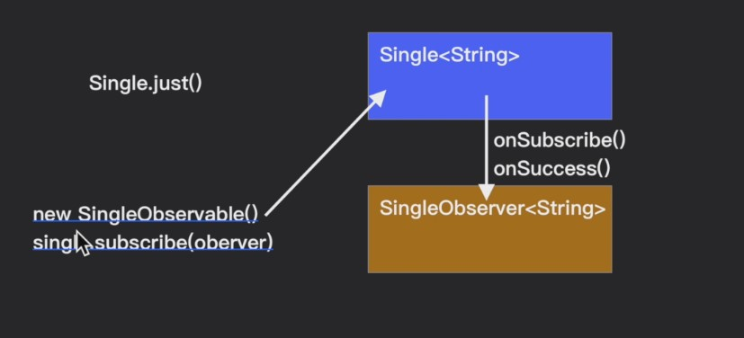
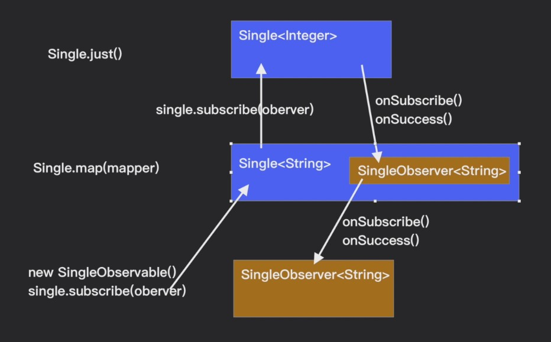
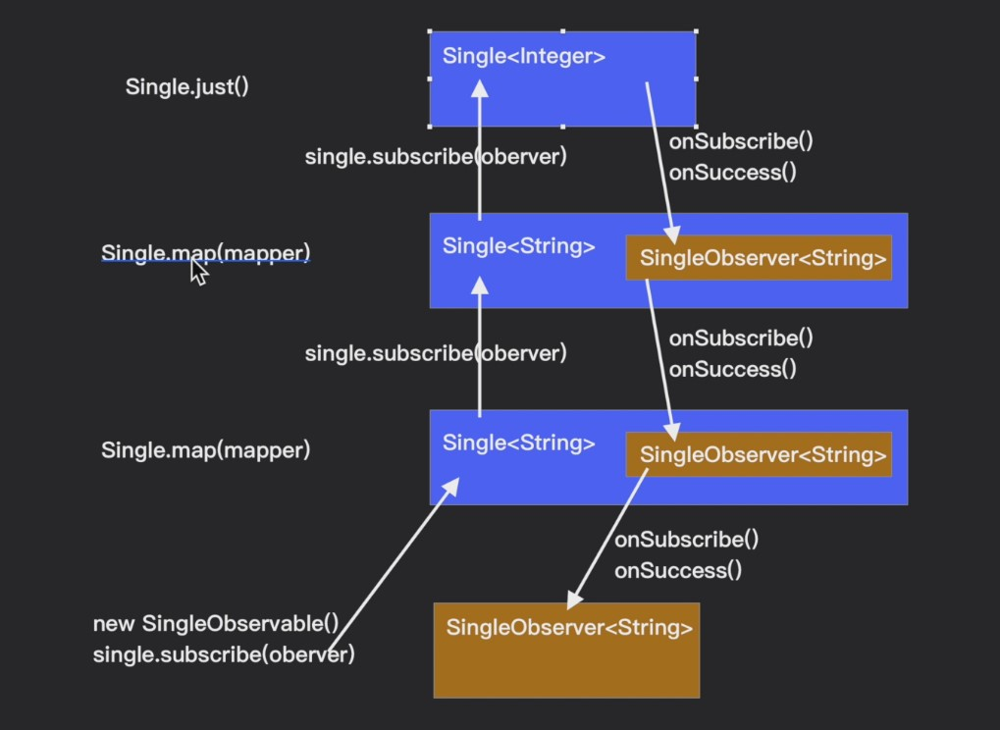
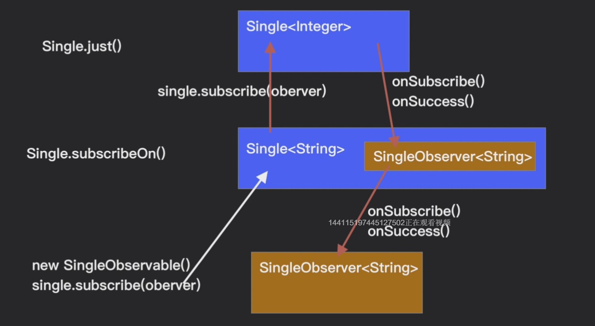
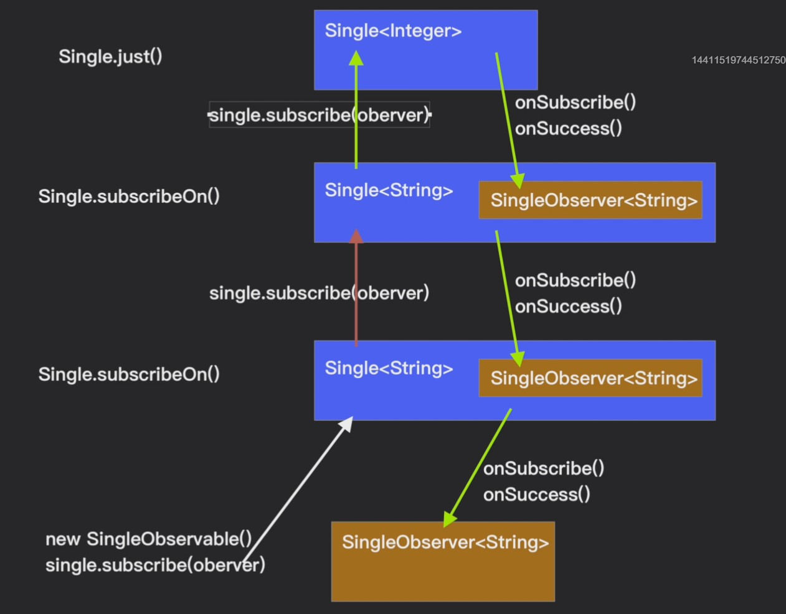
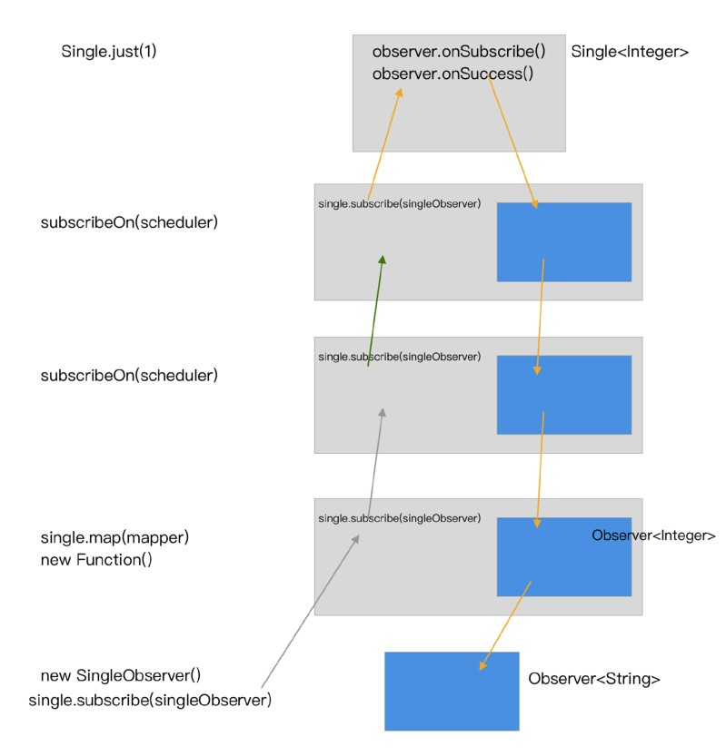
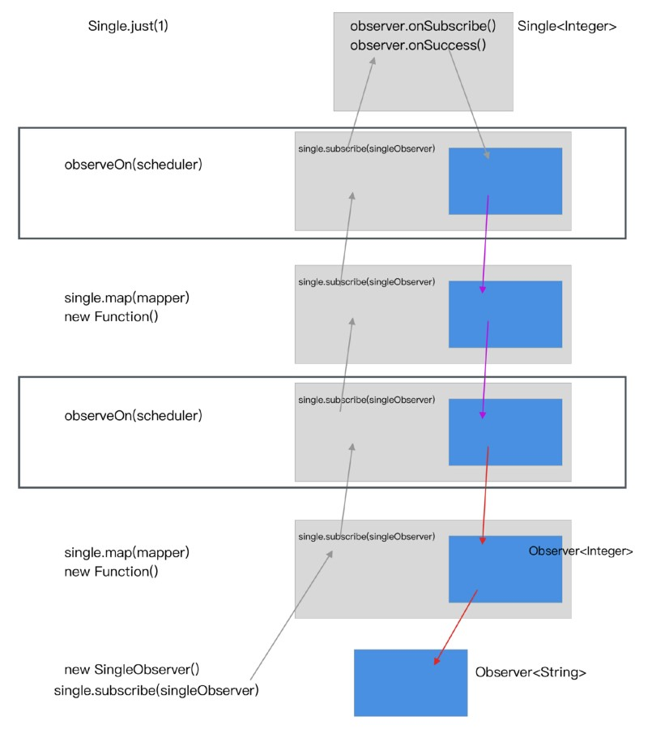

# RxJava2原理解析


### 基本使用
添加依赖
```groovy
//retrofit 依赖
implementation 'com.squareup.retrofit2:retrofit:2.6.0'
implementation 'com.squareup.retrofit2:adapter-rxjava2:2.6.0'
implementation 'com.squareup.retrofit2:converter-gson:2.6.0'

//RxJava依赖
implementation 'io.reactivex.rxjava2:rxjava:2.2.8'
implementation 'io.reactivex.rxjava2:rxandroid:2.1.1'
```

定义Api请求接口仓库
```kotlin
interface ApiStore {
    @GET("/users/{user}/repos")
    fun listRepos(@Path("user") user: String): Single<Any>
}
```

发起网络请求
```kotlin
val mRetrofit = Retrofit.Builder()
    .baseUrl("https://api.github.com/")
    .addConverterFactory(GsonConverterFactory.create())
    .addCallAdapterFactory(RxJava2CallAdapterFactory.create())
    //默认所有订阅都在IO线程中执行
    // .addCallAdapterFactory(RxJava2CallAdapterFactory.createWithScheduler(Schedulers.io())) 
    .build()

val apiStore = mRetrofit.create(ApiStore::class.java)
apiStore.listRepos("hsicen")
    .subscribeOn(Schedulers.newThread())
    .observeOn(AndroidSchedulers.mainThread())
    .subscribe(object : SingleObserver<Any> {
        override fun onSuccess(t: Any) {
            Log.d("hsc", t.toString())
            tv_info.text = t.toString()
        }
        
        override fun onSubscribe(d: Disposable) {
            //获取可取消对象，方便后续取消请求
        }

        override fun onError(e: Throwable) {
            Log.d("hsc", "请求失败")
            tv_info.text = "请求失败"
        }
    })
```

### 框架结构

RxJava的整体结构是一条链

1. 链的最上游：生产者(被观察者)  Observable/Single/Flowable
2. 链的最下游：消费者(观察者) Observer
3. 链的中间：各个中介节点，即是下游的 Observable，又是上游的 Observer，连接(订阅) Subscribe


### 原理分析
先来看看简单的使用 Single.just(xxx)
```kotlin
Single.just(1)
    .subscribe(object : SingleObserver<Int> {
        override fun onSuccess(t: Int) {
            tv_info.text = "$t"
        }

        override fun onSubscribe(d: Disposable) {
            tv_info.text = "开始"
        }

        override fun onError(e: Throwable) {
            tv_info.text = "出错"
        }
    })
```

这里我们利用Single.just()，在上游发送了一个简单的1，下游订阅这个事件，在onSuccess()中接收到事件后然后打印出来；由于Single没有后续事件，所以只有开始订阅onSubscribe，成功onSuccess，失败onError三个方法；可以看到上面的代码并没有进行线程的切换，所有事件的发生都是在当前线程中进行的，也就是UI线程

现在我们点进subscribe中，看看上游和下游是怎样连接起来的

```java
public final void subscribe(SingleObserver<? super T> observer) {
    ObjectHelper.requireNonNull(observer, "observer is null");
    observer = RxJavaPlugins.onSubscribe(this, observer);
    ObjectHelper.requireNonNull(observer, "The RxJavaPlugins.onSubscribe hook returned a null SingleObserver. Please check the handler provided to RxJavaPlugins.setOnSingleSubscribe for invalid null returns. Further reading: https://github.com/ReactiveX/RxJava/wiki/Plugins");
    
    //去掉了 try-catch 异常处理
    subscribeActual(observer);
}
```

可以看到在这个方法中起主要作用的就一句代码 `subscribeActual(observer)`, 所以我们只需要找到这个方法，看它里面做了什么操作，就知道是怎样连接起来的了，下面我们就点进这个方法

```java
protected abstract void subscribeActual(@NonNull SingleObserver<? super T> observer);
```

这是一个抽象方法，没有具体的实现，但是我们可以发现，这是Single这个类的抽象方法，所以们只需要找到这个类的实现类，也就可以找到这个抽象方法的具体实现；但是先别忙，我们不是还有一句代码没有看么，那我们先看看Single.just()做了什么操作

```java
public static <T> Single<T> just(final T item) {
    ObjectHelper.requireNonNull(item, "item is null");
    return RxJavaPlugins.onAssembly(new SingleJust<T>(item));
}
```

这个方法没有做什么操作，最主要的就是最后一句代码，返回了一个SingleJust对象，这个SingleJust应该就是Just的实现类，现在我们点进这个类

```java
public final class SingleJust<T> extends Single<T> {
    final T value;
    
    public SingleJust(T value) {
        this.value = value;
    }

    @Override
    protected void subscribeActual(SingleObserver<? super T> observer) {
        observer.onSubscribe(Disposables.disposed());
        observer.onSuccess(value);
    }
}
```

可以看到在这个类的subscribeActual方法中，直接调用了下游的onSubscribe()和onSuccess()方法，onError方法都不需要调用，而且在订阅的时候调用的是`Disposables.disposed()`,应该是要返回一个可取消订阅的对象，那么点进这个方法，看看返回的是什么对象

```java
public static Disposable disposed() {
    return EmptyDisposable.INSTANCE;
}


public enum EmptyDisposable implements QueueDisposable<Object> {
    INSTANCE,NEVER;

    @Override
    public void dispose() {
        // no-op
    }

    @Override
    public boolean isDisposed() {
        return this == INSTANCE;
    }
}
```

通过源码可以看到返回的是一个EmptyDisposable，这个Disposable在创建时就默认已经取消了，所以Single.just()，一个没有后续操作的事件，流程大致如下



**SingleJust just = Single.just(1);**	创建被观察者

**just.subscribe(observer);**	订阅(连接观察者和被观察者)

**just.subscribeActual(observer);**		核心操作


接下来看一个复杂一点的，有后续操作的事件 `Observable.interval()`

```kotlin
Observable.interval(1, TimeUnit.SECONDS)
    .observeOn(AndroidSchedulers.mainThread())
    .subscribe(object : Observer<Long> {
        override fun onComplete() {
            tv_info.text = "结束"
        }

        override fun onSubscribe(d: Disposable) {
            Log.d("hsc", " 线程： " + Thread.currentThread().name)
            tv_info.text = "开始"
        }

        override fun onNext(t: Long) {
            Log.d("hsc", " 线程： " + Thread.currentThread().name)
            tv_info.text = "$t"
        }

        override fun onError(e: Throwable) {
            tv_info.text = "出错"
        }
    })
```

上面代码的功能是每个一秒发送一个事件，下游接收到这个事件后打印出来；那么我们分析源码还是先从subscribe()方法切入

```java
public final void subscribe(Observer<? super T> observer) {
    ObjectHelper.requireNonNull(observer, "observer is null");
    observer = RxJavaPlugins.onSubscribe(this, observer);
    ObjectHelper.requireNonNull(observer, "The RxJavaPlugins.onSubscribe hook returned a null Observer. Please change the handler provided to RxJavaPlugins.setOnObservableSubscribe for invalid null returns. Further reading: https://github.com/ReactiveX/RxJava/wiki/Plugins");
    
    subscribeActual(observer);
}
```

可以发现，起主要作用的还是 `subscribeActual(observer)`方法，这个方法同样是Observable的抽象方法，所以，下面需要从另一方向切入，看看Observable.interval()做了什么操作

```java
public static Observable<Long> interval(long period, TimeUnit unit) {
    return interval(period, period, unit, Schedulers.computation());
}
```

可以看到这里进行了一层包装，而且为我们切换了线程，这也是为什么上面我们调用了`observeOn()`,主动进行了线程切换的原因，继续点进去

```java
public static Observable<Long> interval(long initialDelay, long period, TimeUnit unit, Scheduler scheduler) {
    ObjectHelper.requireNonNull(unit, "unit is null");
    ObjectHelper.requireNonNull(scheduler, "scheduler is null");

    return RxJavaPlugins.onAssembly(new ObservableInterval(Math.max(0L, initialDelay), Math.max(0L, period), unit, scheduler));
}
```

在这个interval()方法中，就和上面的Single.just()类似了，给我们返回了一个`ObservableInterval`类，而且对我们的传进来的参数进行了兼容性处理，现在我们就点进去看`subscribeActual()`所做的处理

```java
public void subscribeActual(Observer<? super Long> observer) {
    IntervalObserver is = new IntervalObserver(observer);
    observer.onSubscribe(is);

    Scheduler sch = scheduler;

    if (sch instanceof TrampolineScheduler) {
        Worker worker = sch.createWorker();
        is.setResource(worker);
        worker.schedulePeriodically(is, initialDelay, period, unit);
    } else {
        Disposable d = sch.schedulePeriodicallyDirect(is, initialDelay, period, unit);
        is.setResource(d);
    }
}
```

首先将下游observer进行了包装，创建了一个IntervalObserver，这个IntervalObserver是一个可取消对象，实现了Disposable, Runnable接口， 然后调用了下游的订阅方法，把这个可取消对象传了过去；然后就分支判断，除非主动设置，一般情况下都会走默认的else分支；在else分支中先调用Scheduler的方法进行了线程切换，后面有专门讲Scheduler的原理，这里只简单的讲一下这行代码的作用，就是进行线程切换，最后调用`is.setResource(d)`方法，这个方法的作用先不分析，现在只需要记住有这个方法，后面会返回来分析这个方法的作用

现在我们点进IntervalObserver，看看它的后台任务(run)是怎样执行的

```java
@Override
public void run() {
	if (get() != DisposableHelper.DISPOSED) {
		downstream.onNext(count++);
	}
}
    
public void setResource(Disposable d) {
	DisposableHelper.setOnce(this, d);
}
```

可以看到IntervalObserver继承自AtomicReference，实现了Disposable和Runnable接口，在run方法中先判断是否已经取消了订阅，若没有取消订阅，会调用下游的onNext()方法，然后count加1；可以看到可取消对象都是通过DisposableHelper来管理的，包括我们刚才的setResource(d)，这个setResource()方法只是一层包装，里面是设置给DisposableHelper的，然后取消时也是通过DisposableHelper来取消的，这个可取消对象继承自AtomicReferenc，是线程安全的，总结Observable.interval()流程如下：

订阅过程：Observable.interval() -> ObservableInterval.subscribe(observer) -> subscribeActual(observer) -> IntervalObserver.run() -> observer.onNext()

取消订阅过程：IntervalObserver.setResource(d) -> DisposableHelper处理


### 操作符分析

先来看一下没有后续操作事件的操作符

```kotlin
Single.just(1)
    .map { it + 3 }
    .subscribe(object : SingleObserver<Int> {
        override fun onSuccess(t: Int) {
            tv_info.text = "$t"
        }

        override fun onSubscribe(d: Disposable) {
            tv_info.text = "开始"
        }

        override fun onError(e: Throwable) {
            tv_info.text = "出错"
        }
    })
```

前面已经分析了just和subscribe所做的事情，现在我们点进map

```kotlin
public final <R> Single<R> map(Function<? super T, ? extends R> mapper) {
    ObjectHelper.requireNonNull(mapper, "mapper is null");
    return RxJavaPlugins.onAssembly(new SingleMap<T, R>(this, mapper));
}
```

可以看到创建了一个新的对象SingleMap，传进去了Single对象和map的操作逻辑函数，当下游的Observer调用subscribeActual()方法时，就会调用SingleMap的subscribeActual()方法

```java
public final class SingleMap<T, R> extends Single<R> {
    final SingleSource<? extends T> source;
    final Function<? super T, ? extends R> mapper;

    public SingleMap(SingleSource<? extends T> source, Function<? super T, ? extends R> mapper) {
        this.source = source;
        this.mapper = mapper;
    }

    @Override
    protected void subscribeActual(final SingleObserver<? super R> t) {
        source.subscribe(new MapSingleObserver<T, R>(t, mapper));
    }
}
```

可以看到subscribeActual()方法中，调用了source的subscribe()方法，这个Source就是我们Single.just()创建的SingleJust，而且将下游的Observer进行了一层包装，创建了一个MapSingleObserver，在SingleJust的subscribe()方法中会调用subscribeActual()方法，然后流程就和上面没有操作符的流程一样了

现在还需要弄清楚是如何将数据传递给下游的Observer的，那么就需要弄清楚MapSingleObserver做了什么操作

```java
static final class MapSingleObserver<T, R> implements SingleObserver<T> {
	final SingleObserver<? super R> t;
	final Function<? super T, ? extends R> mapper;
        
	MapSingleObserver(SingleObserver<? super R> t, Function<? super T, ? extends R> mapper) {
		this.t = t;
		this.mapper = mapper;
	}

	@Override
	public void onSubscribe(Disposable d) {
		t.onSubscribe(d);
	}

	@Override
	public void onSuccess(T value) { 
		R v = ObjectHelper.requireNonNull(mapper.apply(value), "The mapper function returned a null value.");
		t.onSuccess(v);
	}

	@Override
	public void onError(Throwable e) {
		t.onError(e);
	}
}
```

可以看到MapSingleObserver中，除了在onSuccess()中将数据进行转换外，其它都是将事件直接传递给下游的Observer的，下面简单总结一下事件的流程：



>上游：
>
>Single.just() -> 创建SingleJust对象
>
>SingleJust.map(mapper) -> 创建SingleMap(SingleJust, mapper)对象 
>
>SingleMap.subscribe(Observer) -> 链接上下游发生订阅
>
>SingleMap.subscribeActual() -> 在订阅方法subscribe()中调用
>
>SingleJust.subscribe(MapSingleObserver(Observer,mapper)) 
>
>SingleJust.subscribeActual(Observer) -> 发送事件到下游

>下游：
>
>SingleMap.subscribe(Observer) -> 链接上游和下游
>
>SingleJust.subscribe(MapSingleObserver(Observer,mapper))
>
>SingleJust.subscribeActual(MapSingleObserver) -> 发送事件到中转Observer
>
>MapSingleObserver   中转SingleJust的事件到下游Observer

如果有多个操作会怎么样呢？有了上面的分析，其实我们可以发现当存在多个操作符时，首先上游基于每个操作符都会创建一个新的Observable，在新的Observable的subscribeActual()方法中回调用source的subscribe()方法；然后下游Observer会封装自己subscribe()方法传进来的Observer，创建一个新的Observer，这个新的Observer充当的是一个中转的角色，它会把自己source传递过来的事件传递给通过subscribe传递过来的下游Observer；所以**Observable是一层一层的往上传**，而**Observer是一层一层的往下传**



对于有后续操作的事件，其流程也是一样的，每一个操作符都会创建新的Observable对象和Observer对象，用于链接上游和下游，传递事件

### Disposable 原理分析

这个模块主要分析一下订阅的取消流程，订阅的取消要分多种情况，根据下面几种分类来分析一下

##### 没延迟，没后续操作

这种情况是最简单的，直接就是Single.just(xxx).subscribe(Observer)

在这种情况下，当发生订阅时，会调用Disposables.disposed()返回一个已经取消订阅的Disposable对象

##### 没延迟，有后续操作

这种情况就是我们上面提到的Observable.interval()

在这种情况下，会创建一个IntervalObserver和一个后台执行onNext操作的Worker对象，当发生订阅时会把这个可取消对象传递给下游，下游调用dispose()取消订阅时，会调用DisposableHelper.dispose()来处理取消订阅操作；首先会把DisposableHelper置为DISPOSED的状态，然后把自己内部创建的worker取消掉(这个Worker是执行后续onNext操作的Worker)

##### 有延迟，没后续操作

这种情况相当于给第一种情况加上了**delay()**操作符(**会自动切换线程**)

在这种情况下，会创建一个SequentialDisposable对象，然后在订阅时把这个可取消对象传给下游，下游拿到这个可取消对象就可以自由操作了；当触发成功和失败事件时，会创建一个DisposeTask，利用Scheduler延时发给下游Observer，并调用SequentialDisposable的**replace()来替换掉之前的Disposable可取消对象**，当下游调用dispose()时，会交由DisposableHelper.dispose()来处理取消订阅操作；由于有延时，会创建Worker对象来处理延时操作，当调用DisposableHelper.dispose()时，首先会把DisposableHelper置为DISPOSED的状态，然后把处理延时操作的Worker取消掉

##### 有延时，有后续操作

这种情况相当于给第二种情况加上了delay()操作符

在这种情况下，默认会创建一个SerializedObserver和一个后台执行onNext操作的Worker对象；当发生订阅时直接调用下游的onSubscribe()，onNext(),onError(),onComplete()都会交由Worker进行延迟下发；当调用dispose()取消订阅时，会调用上游的dispose()和自己内部Worker的取消


### 线程切换原理分析

RxJava有两个线程切换方法，**subscribeOn()**和**observerOn()**,这两个方法各有用处，下面就来分析一下这两个方法所做的事情

##### subscribeOn

**功能：**在Scheduler指定的线程里启动订阅 **subscribe()**

**效果：**
- 切换起源的 Observable 线程
- 当多次调用 subscribeOn() 的时候，只有第一个subscribeOn()会对起源的 Observable 起作用；后续的subscribeOn()会影响onSubscribe()的调用线程

单次调用subscribeOn()的大致流程如下：



多次调用subscribeOn()的大致流程如下：



当带有操作符的多次调用subscribeOn()的大致流程如下：



##### observeOn
**功能：** 在内部创建的 Observer的 onNext(), onError(), onSuccess()/onComplete() 等回调方法里，通过Scheduler 指定的线程来调用下级Observer的对应回调方法

**效果：**
- 切换 observeOn() 下面的 Observer 的回调所在的线程
- 当多次调用 observeOn() 的时候，每个都会进行一次线程切换，影响范围是它下面的每个Observer

流程大致如下：



### Scheduler原理
这里主要涉及到两个类，Schedulers 和 AndroidSchedulers

1. Schedulers.newThread() 和 Schedulers.io()，Schedulers.computation()
   - 当scheduleDirect() 被调用时，会创建一个Worker，Worker的内部会有一个Executor，由Executor来完成实际的线程切换操作
   - scheduleDirect() 还会创建出一个Disposable 对象，交给外层的Observer，让它能够执行dispose()操作，取消订阅链
   - newThread() 和 io() 的区别在于，io是创建的缓存池，可能会对Executor进行重用；computation创建的是线程池

2. AndroidSchedulers.mainThread()
   - 创建Handler，获取到mainLooper，发送消息到主线程执行